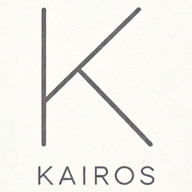
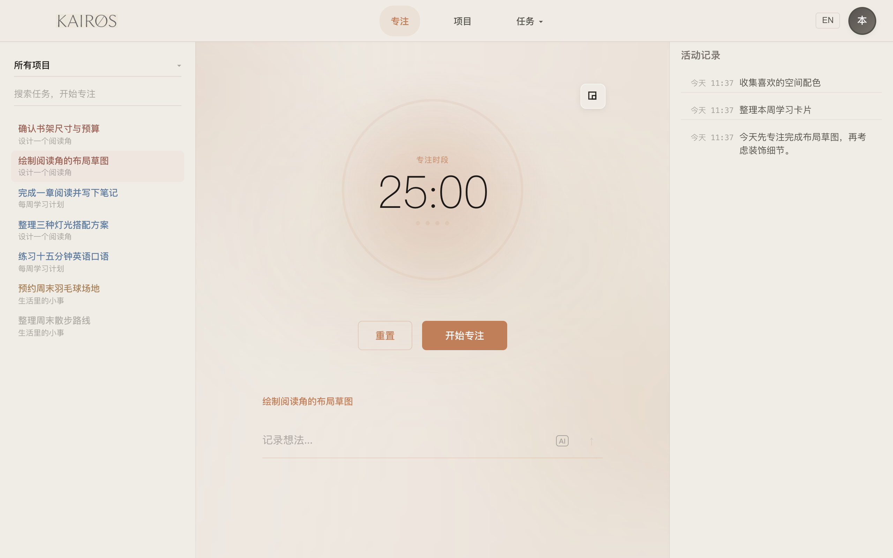
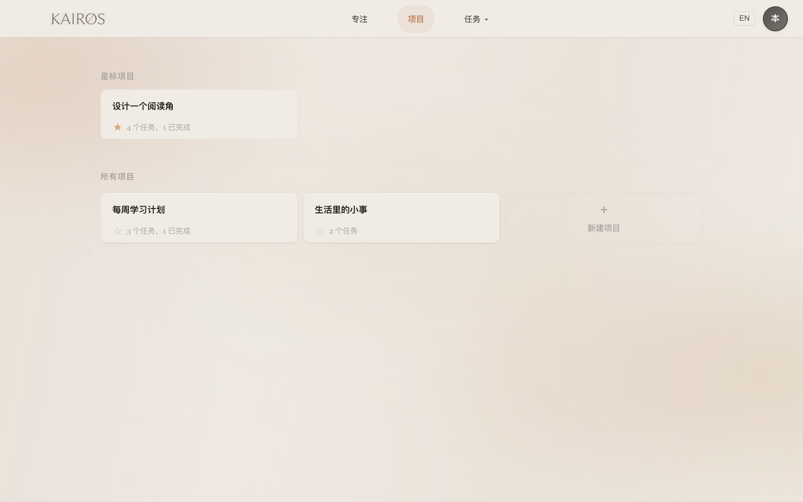
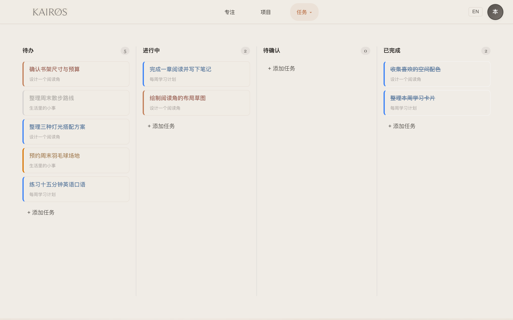
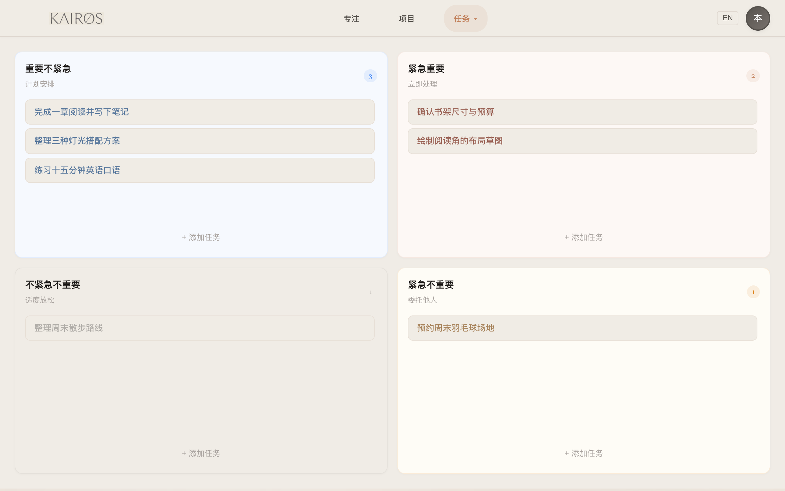
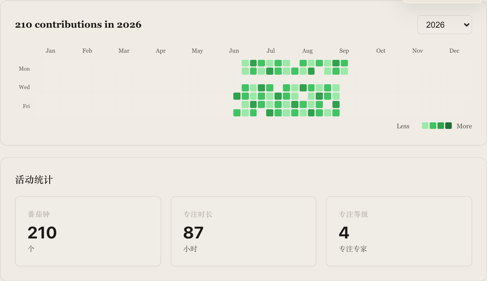

<p align="center">
  
</p>

<h1 align="center">Kairos · 时流</h1>

<p align="center"><strong>安排好任务，专注于当下。</strong><br>一个将番茄钟、任务管理与专注记录放在一起的本地应用。</p>

<p align="center">
  <a href="https://github.com/zhtyyx/kairos/stargazers"></a>
  <a href="https://github.com/zhtyyx/kairos/actions/workflows/verify.yml"></a>
  <a href="LICENSE"></a>
</p>

<p align="center">
  <a href="#功能一览">功能一览</a> ·
  <a href="#快速开始">快速开始</a> ·
  <a href="#部署到自己的站点">自行部署</a> ·
  <a href="#star-history">Star History</a>
</p>

---

**无需注册，无需后端，打开浏览器就能开始。** 按项目整理任务，用看板查看进度，用四象限安排优先级，再选择一项任务开始专注。数据保存在自己的设备上。

## 功能一览

### 专注计时 · 一次做好一件事

从左侧选中任务，开始一个番茄钟。计时、任务与随手记录放在同一页，专注时不用来回切换；需要腾出屏幕空间时，还可以切换迷你计时器。

<p align="center">
  
</p>

### 项目管理 · 给不同的事情各留一个位置

把工作、学习和生活分成项目，星标常用项目。任务数量与完成进度直接显示在卡片上，打开就知道从哪里继续。

<p align="center">
  
</p>

### 进度看板 · 看清哪些在推进，哪些已完成

同一批任务按「待办、进行中、待确认、已完成」排列。项目名称和优先级颜色随卡片一起显示，跨项目查看进度也有条理。

<p align="center">
  
</p>

### 四象限 · 先做重要的事

换到四象限视图，按重要程度与紧急程度安排任务。需要立即处理的事、值得长期投入的事、可以稍后再做的事，一眼就能区分。

<p align="center">
  
</p>

### 专注回顾 · 让每天的投入看得见

年度热力图记录专注的节奏，活动统计汇总番茄钟数量与专注时长。回头看一眼，了解自己在哪些日子持续投入。

<p align="center">
  
</p>

<sub>以上为浅色主题的实际界面截图，项目、任务和历史记录均为虚构示例。</sub>

**还有这些日常功能：** 中英双语与深浅主题、PWA 安装和离线使用、JSON 导入导出，以及连接自有模型服务的 AI 任务拆解。


## 快速开始

需要 **Node.js 22.12+** 和 npm。

```bash
git clone https://github.com/zhtyyx/kairos.git
cd kairos
npm ci
npm run dev
```

打开 [http://localhost:3001](http://localhost:3001)，创建项目或任务，选择任务后开始专注。界面支持中文和英文、浅色和深色主题。

## 部署到自己的站点

```bash
npm run build
```

将生成的 **`dist-pwa/`** 目录部署到 HTTPS 静态托管服务即可，不需要数据库或环境变量。

- 部署在域名根路径，并将未匹配的页面路由回退到 `index.html`。
- 为 `/sw.js` 设置 `Cache-Control: no-cache`，方便浏览器检查更新。
- 只上传 `dist-pwa/`。构建会带上项目许可证和第三方许可声明。

生产版本会缓存应用资源，首次成功加载后可离线使用本地功能；AI 仍需要网络。PWA 安装方式取决于浏览器支持。

## 数据与备份

任务、项目和专注记录保存在**当前浏览器的 IndexedDB** 中，不会自动上传或跨设备同步。同一设备的不同浏览器、不同域名也各有自己的数据。

在设置中使用「导出数据」保存 JSON 备份，使用「导入数据」恢复。清理站点数据、更换浏览器或域名前，请先导出。备份里可能包含个人任务内容，请妥善保存。

<details>
<summary><strong>可选：配置 AI 任务拆解</strong></summary>

在设置中填写服务地址、模型名称和 API Key。默认地址为 `https://api.deepseek.com/v1`，也可使用支持 `/chat/completions` 接口且允许浏览器跨域请求的服务。

API Key 保存在当前浏览器的 localStorage。调用时，Key 和对话内容直接发送到你配置的服务；费用和可用性由该服务决定。未配置 Key 时，AI 不启用，番茄钟和任务管理照常使用。

</details>

## 开发与贡献

前端使用原生 JavaScript、SCSS 和 Vite，浏览器测试使用 Playwright。

| 路径 | 内容 |
| --- | --- |
| `web/` | 界面、数据存储和 PWA |
| `tests/` | 交互、数据保存和隐私测试 |
| `scripts/` | 仓库文件与提交历史扫描 |

开发检查见[贡献指南](.github/CONTRIBUTING.md)，漏洞报告见[安全说明](.github/SECURITY.md)。

## Star History

如果 Kairos 对你有帮助，欢迎点一颗 Star。

<p align="center">
  <a href="https://www.star-history.com/#zhtyyx/kairos&amp;Date">
    <picture>
      <source media="(prefers-color-scheme: dark)" srcset="https://api.star-history.com/svg?repos=zhtyyx/kairos&amp;type=Date&amp;theme=dark">
      <source media="(prefers-color-scheme: light)" srcset="https://api.star-history.com/svg?repos=zhtyyx/kairos&amp;type=Date">
      
    </picture>
  </a>
</p>

## 许可证

Copyright © 2025–2026 KAIROS.

本项目采用 [Apache-2.0](LICENSE) 许可证。第三方依赖的版权与许可见[第三方声明](docs/THIRD_PARTY_NOTICES.md)。
